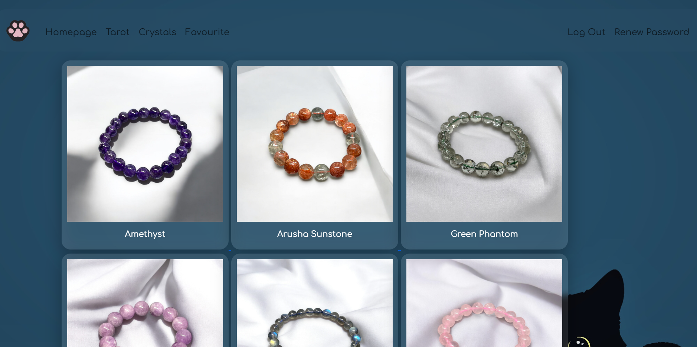
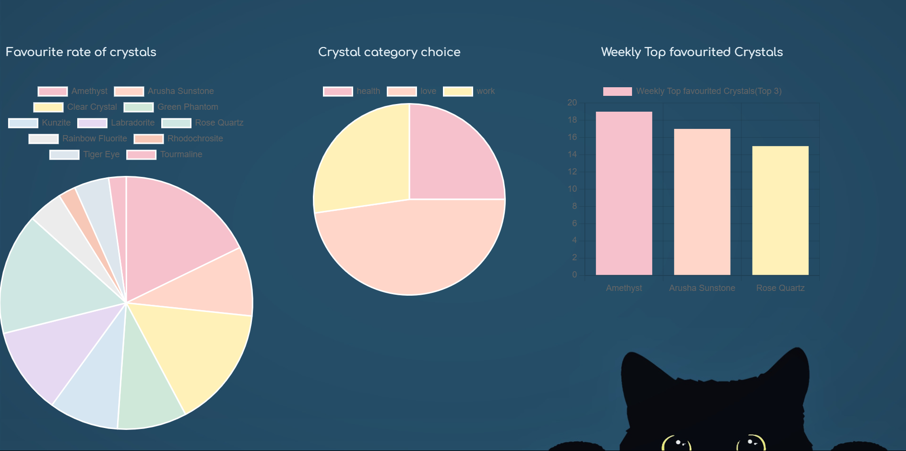
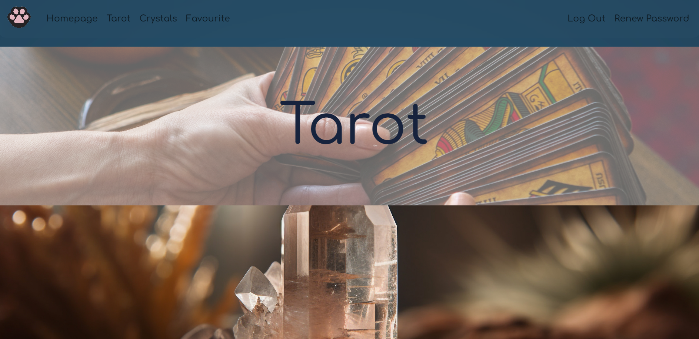
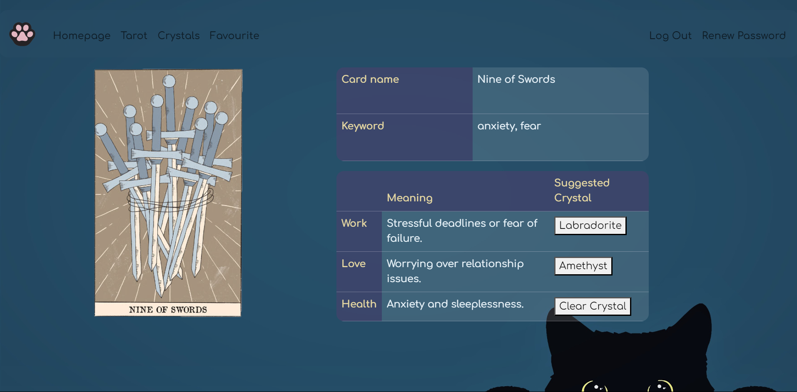

# Black CAT ARCANA-Full Stack Web Application

## Hosted on Render with static assets stored on AWS S3.
### https://black-cat-arcana-tarot-crystal-fullstack.onrender.com/

### Overview:
Black CAT ARCANA is a full‑stack web application built with Flask, HTML, JavaScript, CSS, and SQLite.

The website uses a dark, mysterious black‑cat theme while keeping the interface simple and user‑friendly.

The idea comes from my small crystal‑jewelry business and my background in fortune‑telling.
Users draw a random tarot card, and the system suggests a crystal that may align with their energy.

The 78 tarot cards, their meanings, and crystal suggestions are stored in a JSON file.
All other data is stored in crystal.db.

---

### Features:
#### `app.py`
1. **Login, Registration, Reset Password**
   - Validates new and existing user credentials.
   - Passwords are securely stored as hashes in crystal.db using Werkzeug.

2. **Tarot**
   - Generates a tarot card using Python’s random module and a JSON file.
   - JSON is used because the tarot deck is fixed (78 cards) and easy to expand with new meanings or spreads.
   - Users can draw **one card every 24 hours** to keep the reading meaningful.
   - Users may view their previous result before drawing a new card.

3. **Crystal**
   - Displays a list of crystals and individual crystal detail pages.
   - All crystal pages share the same HTML template for consistency and easier maintenance.
   - Crystal data is stored in SQL, making it easy to add new crystals in a unified format.
   - Includes a favourite system.
   

4. **Dashboard**
   - The dashboard is separated into two pages: User Activity and Content. Both pages require direct URL access and admin login for double security.
   - **User Activity**: daily login data (“daily views”), daily tarot draws, and weekly most active users. 
   - **Content**:  weekly top-favourited crystals, favourite rate, and category preferences.
---

### Demo/Screenshots:

#### Video Demo: https://youtu.be/XqFgSrxDcdk

**Note: Only essential UI images and screenshots are included to keep the repository lightweight.**


*Crystal showcase interface*


*Content dashboard interface*


*Front page interface*


*Tarot reading interface*

---

### How to run:
1. Ensure your platform can run Python. 

2. Install required modules: 
```bash 
pip install -r requirements.txt 
``` 

3. Run the application:
 ```bash 
flask run 
```

4. Click the link shown in the terminal.
---

### Project Structure:
```
.
├── app.py
├── helper.py
├── crystal.db
├── tarot.json
├── templates/
│   ├── crystal.html
│   ├── crystalshowcase.html
│   ├── dashboard1.html
│   ├── dashboard2.html
│   ├── favourite.html
│   ├── index.html
│   ├── layout.html
│   ├── login.html
│   ├── lucky.html
│   ├── registration.html
│   ├── renewpw.html
│   └── tarot.html
├── static/
│   ├── draw_card.gif
│   ├── heart.png
│   ├── heart_empty.png
│   └── styles.css
└── assets/
    ├──crystal_showcase.png
    ├── dashboard2.png
    ├── frontpage.png
    └── tarot_reading.png

```
---

### What I Learned:
- Flask/Jinja
- HTML, CSS, Bootstrap
- SQL for storing ,updating and selecting data 
- JavaScript for generating charts
- Importance of choosing correct data type
- Password hashing with Werkzeug 
- Dynamic URL generation 
---

### Future Improvements:
- **Expanded tarot spreads:** Allow multi‑card draws and more complex tarot spreads.
- **Improved UI/UX:**Add smoother animations and make the interface more responsive.
- **Expanded crystal database:** Add more crystals to enrich the content.
- **Optimizing Query Logic:** Move time‑based checks from Python to SQL (e.g., datetime('now','-1 day')) to improve performance.
- **Recommendation system:** Use favourite data to recommend similar crystals and support future business/event planning.
- **Enhanced analytics:** Expand the existing dashboard to provide deeper insights, such as popular crystals, tarot‑draw behaviour, and category preferences, helping with content planning and user engagement.
---

### Credit:
CS50X Final Project


